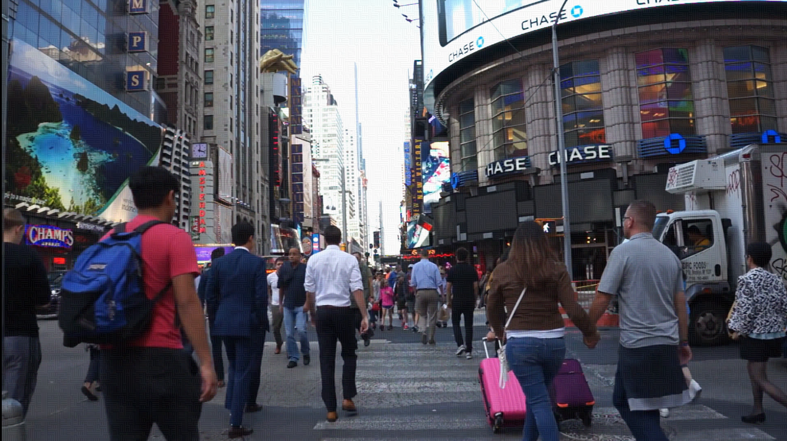

# stegano-II
Steganographic experiments-II with Youtube

## About

This Golang-based program ingeniously exploits binary files into a YouTube-movie format. Designed with a creative approach to data storage, it turns YouTube into an unconventional but highly accessible storage medium. However, the process does present some robustness issues given the complexities of maintaining data integrity through conversion, upload, and retrieval. To tackle these challenges, the program incorporates a specialized algorithm ensuring the robustness of the data both when saving information into the movie format and during recovery from the YouTube movie. This unique function essentially enables a novel way of data preservation and retrieval via a globally accessible platform like YouTube. 
[More about](https://www.aleksiej.com/id/H3XOqkzQuOR6/index.html)

## Warning

It was developed and tested on Ubuntu 22.04 (Linux). Given its specific environment, usage in other operating systems may require modification.

## The acceptor-video, hd1080:

[](https://www.youtube.com/watch?v=aADa2FI6iDo)

## The donor-file:

Pushkin's novel "Dubrovsky"

## Steganography after optimization in Youtube storage, hd1080:

[](https://www.youtube.com/watch?v=7WhQfMocbQQ&vq=hd1080)

## Steganography after optimization in Youtube storage, hd720:

[](https://www.youtube.com/watch?v=7WhQfMocbQQ&vq=hd720)

## Steganography prepared in the "comfortable" mode, hd1080

[](https://cloud.mail.ru/public/8seB/9WvfZQmPk)

## Steganography, comparison of "aggressive" and "comfortable" modes, hd1080

[](https://www.youtube.com/watch?v=mHwFzTiwkqc)


## To run this experiment, follow these steps:

```bash
# step -1
# 1. Install ffmpeg library...
# 2. Install Python requirements:

python3 -m pip install -r ./wrap/requirements.txt

# 3. Install Golang requirements:

go get -u github.com/edsrzf/mmap-go
go get -u "golang.org/x/image/bmp"

```

```bash
# bash step0.sh
# Compiling the utility

GO111MODULE=off go build stegano2.go
```

```bash
# bash step1.sh
# Wrapping an input file with a correction code Bose-Chaudhuri-Hocquenghem

python3 ./wrap/codilla.py -input "./data/dubrowskij.txt" -output "./data/dubrowskij.txt.crp" -e
```

```bash
# bash step2.sh
# "Attention! Steganography takes about 30 minutes in this case"    
    
time ./stegano2 e 1 "123" "./data/dubrowskij.txt.crp" "./data/new_peoplenyc1080p.mp4" 
```

```bash
# bash step3.sh

# echo "1. Please, upload the file-result, for example './data/dubrowskij.txt.crp_filesize58435200.webm' to Youtube"    
# echo "2. Wait about 10 minutes while Youtube chews the file..."    
# echo "3. Download the chewed file from Youtube and move it to folder './data'. This file may have a name like 'dubrowskij txt crp filesize58435200 [7WhQfMocbQQ].mkv'"
```

```bash
# bash step4.sh

time ./stegano2 d 1 "123" "./data/dubrowskij txt crp filesize58435200 [7WhQfMocbQQ].mkv"
```

```bash
# bash step5.sh
# File recovery via correction code

python3 ./wrap/codilla.py -input "./data/dubrowskij txt crp filesize58435200 [7WhQfMocbQQ].mkv.original" -output "./data/dubrowskij.txt.youtube" -d
```

```bash
# bash step6.sh
# Checking the result

md5sum "./data/dubrowskij.txt" "./data/dubrowskij.txt.youtube" | md5sum --check
```

## TODO
- [x] Enncoding is accelerated ~ x1.7
- [x] Decoding is accelerated ~ x2.4
- [ ] Don't unpack all a video at once. Instead, prepare the pipe and send it one frame at a time.

## Paper about this
[Стеганографические эксперименты с видеофайлами и Youtube. Продолжение](https://habr.com/ru/articles/742378/)
