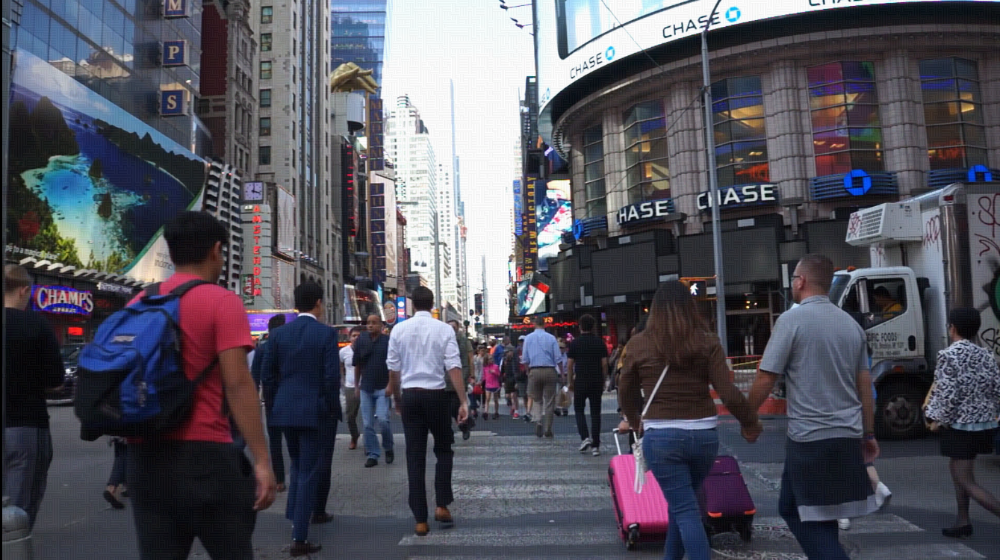

# stegano-II
Steganographic experiments-II with Youtube

## About

This Golang-based program ingeniously exploits binary files into a YouTube-movie format. Designed with a creative approach to data storage, it turns YouTube into an unconventional but highly accessible storage medium. However, the process does present some robustness issues given the complexities of maintaining data integrity through conversion, upload, and retrieval. To tackle these challenges, the program incorporates a specialized algorithm ensuring the robustness of the data both when saving information into the movie format and during recovery from the YouTube movie. This unique function essentially enables a novel way of data preservation and retrieval via a globally accessible platform like YouTube. 
[More about](https://www.aleksiej.com/id/H3XOqkzQuOR6/index.html)

## Warning

It was developed and tested on Ubuntu 22.04 (Linux). Given its specific environment, usage in other operating systems may require modification.

## The acceptor-video, hd1080:

[](https://www.youtube.com/watch?v=aADa2FI6iDo)

## The donor-file:

Pushkin's novel "Dubrovsky"

## Steganography after optimization in Youtube storage, hd1080:

[](https://www.youtube.com/watch?v=7WhQfMocbQQ&vq=hd1080)

## Steganography after optimization in Youtube storage, hd720:

[](https://www.youtube.com/watch?v=7WhQfMocbQQ&vq=hd720)

## Steganography prepared in the "comfortable" mode, hd1080

[](https://cloud.mail.ru/public/8seB/9WvfZQmPk)

## Steganography, comparison of "aggressive" and "comfortable" modes, hd1080

[](https://www.youtube.com/watch?v=mHwFzTiwkqc)


## Requirements

* Go 1.22 or newer (standard library only, no third-party packages);
* `ffmpeg` and `ffprobe` 5.1 or newer with `libx264` and `aac`.

Python is no longer needed: the Bose-Chaudhuri-Hocquenghem wrapping
(former `wrap/codilla.py`) is rewritten in Go and built into
`merge` and `split`.

## To run this experiment, follow these steps:

```bash
# bash step0.sh
# Compiling the utility

go build -o stegano2 .
```

```bash
# bash step1.sh
# Hiding the file in the video. The data is wrapped with the
# correction code Bose-Chaudhuri-Hocquenghem at this step.

./stegano2 merge --key "123" --mode aggressive \
    --data "./data/dubrowskij.txt" \
    --original "./data/new_peoplenyc1080p.mp4" \
    --result "./data/new_peoplenyc1080p_new.mp4"
```

```bash
# bash step2.sh

# echo "1. Please, upload the file './data/new_peoplenyc1080p_new.mp4' to Youtube"
# echo "2. Wait about 10 minutes while Youtube chews the file..."
# echo "3. Download the chewed file from Youtube and move it to folder './data'"
```

```bash
# bash step3.sh
# Extracting the file from the video (the original one or
# the one downloaded from Youtube)

./stegano2 split --key "123" \
    --input "./data/new_peoplenyc1080p_new.mp4" \
    --output "./data/dubrowskij_new.txt"
```

```bash
# bash step4.sh
# Checking the result

md5sum "./data/dubrowskij.txt" "./data/dubrowskij_new.txt"
```

`split` needs only the key: the mode and the size of the hidden
data are stored in the video itself (a header protected by the BCH
code, 31 copies and key shuffling). The CRC-32 of the data is
stored as well, so `split` reports whether the file was recovered
without errors.

## Modes

| `--mode`       | pattern share | copies | purpose                         |
|----------------|---------------|--------|---------------------------------|
| `aggressive`   | 0.5           | 25     | YouTube experiments (default)   |
| `experimental` | 0.1           | 15     | intermediate                    |
| `comfortable`  | 0.05          | 10     | only for the current file save  |

## How it works

```
merge:  data -> BCH(127,64) -> N copies -> key shuffle -> header + stream
        ffmpeg (decoder) -> pipe -> Go channel -> consumers draw 8x8 cells
                         -> ordered frames -> pipe -> ffmpeg (encoder)
        ffmpeg (audio)   -> pipe ------------------------^

split:  ffmpeg (decoder) -> pipe -> Go channel -> consumers recognize cells
        header -> stream -> key unshuffle -> voting -> BCH -> data, CRC check
```

* The video is never unpacked to the disk. The decoder writes raw
  frames to a pipe, the reader sends them one by one to a Go channel,
  the consumers process the frames in parallel. The frame buffers are
  reused, so the memory is limited (about 130 MB for hd1080).
* The result is a video H.264 + AAC (`.mp4`, `.mov`, `.mkv`).
* The acceptor-video is repeated a whole number of times to hold all
  the data. The sound of every repetition is trimmed or padded with
  silence to the exact duration of the video, so the sound and the
  picture stay synchronized. A video without sound is supported too.
* `split` stops reading the video as soon as the whole stream is
  collected.

## Packages

| package   | purpose                                                  |
|-----------|----------------------------------------------------------|
| `cli`     | command line parsing                                     |
| `merge`   | command `merge`: plan and pipeline of hiding             |
| `split`   | command `split`: pipeline of extracting                  |
| `ffpipe`  | pipes to ffmpeg, Go channels of frames, consumers        |
| `probe`   | video analysis with ffprobe                              |
| `cell`    | drawing and recognizing 8x8 cells                        |
| `payload` | the data path without video: building and parsing        |
| `header`  | header of the hidden stream                              |
| `wrap`    | BCH container, byte-compatible with former `codilla.py`  |
| `bch`     | code Bose-Chaudhuri-Hocquenghem (127, 64), GF(2^7)       |
| `repeat`  | N copies and bit voting (former `copyXN`)                |
| `stir`    | shuffling by key                                         |
| `bitio`   | bit access to a byte stream                              |
| `mode`    | table of modes                                           |
| `rescode` | result codes                                             |
| `report`  | report of a command                                      |

## Tests

```bash
go test ./...
```

## TODO
- [x] Fixed an error when preparing video without audio track. 24.08.2023
- [x] Enncoding is accelerated ~ x1.7
- [x] Decoding is accelerated ~ x2.4
- [x] Don't unpack all a video at once. Instead, prepare the pipe and send it one frame at a time.
- [x] The correction code Bose-Chaudhuri-Hocquenghem is rewritten in Go and built into `merge` and `split`.

## Paper about this
[Стеганографические эксперименты с видеофайлами и Youtube. Продолжение](https://habr.com/ru/articles/742378/)
